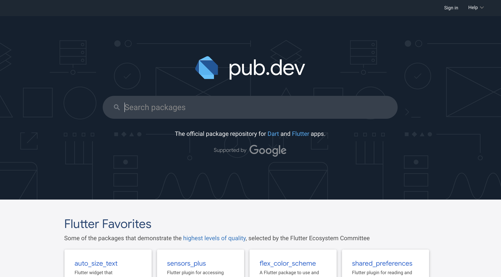

### pub.dev
* https://pub.dev/


### keyword
* 기본 SDK
* 오픈소스 Widget
* Widget Tree
* Stateless Widget
* Stateful Widget


## 기본 SDK의 MaterialApp, Scaffold를 활용한 Hello, Flutter 만들기
<p align="center">
    
</p>


```dart
import 'package:flutter/material.dart';

void main() {
  runApp(
    MaterialApp(
      home: Scaffold(
        body: TestWidget()
      ),
    ),
  );
}

class TestWidget extends StatelessWidget {
  const TestWidget({super.key});

  @override
  Widget build(BuildContext context) {
    return SafeArea(
      child: Center(
        child: Text(
          "Hello, Flutter",
          style: TextStyle(
              fontSize: 60,
              color: Colors.black
          ),
        ),
      ),
    );
  }
}

```