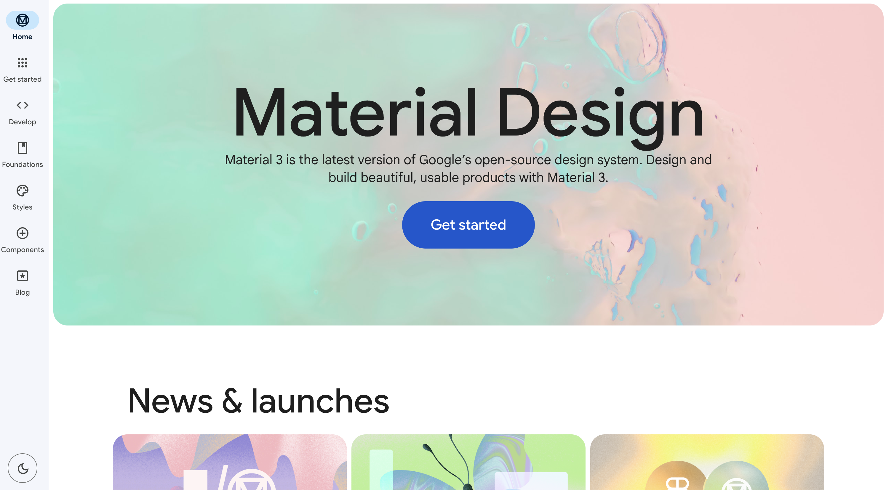
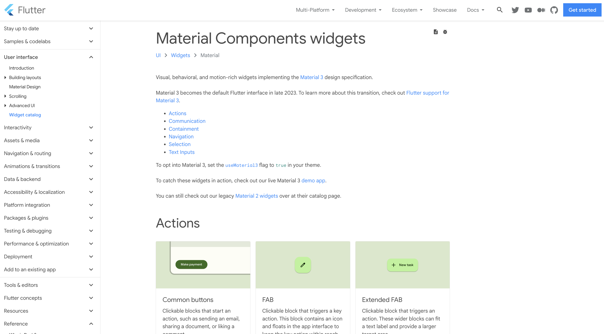

# 준비물
앱 아이콘 바꾸기 위한 준비물: 1024 * 1024 PNG 이미지

1. 직접 디자인 (포토샵, 일러스트, 아이패드)
2. 지인 찬스
3. 크몽, 숨고 디자이너께 외주
4. appicons.ai, icon.kitchen, Midjourney 서비스 이용

나는 4개의 옵션 중에서 Midjourney를 활용해서 앱 아이콘 디자인을 만들었다.

# Midjourney
프롬프트를 여러 번 해본 후 제일 맘에 들었던 이미지를 선택했다. 앱에 대한 기능 설명을 디테일하게 나열하는 것보다 유저 입장에서의 기능을 입력하면 좀더 원하는 이미지를 얻을 수 있다. 예를 들어, '**It is an app for the function of counting numbers by operating the counter when you shake the phone.**' 보다는 유저가 앱을 사용했을 때의 모습을 대략적으로 '**손으로 잡고 흔드는 장면**'이라고 입력하면 된다.
### prompt
**The scene of holding and shaking the phone. flat vector app icon, minimalistic, white background, cute, 2d, 4d**

# appicon.co
생성한 이미지를 [https://www.appicon.co/](https://www.appicon.co/) 해당 사이트에 넣어주면 zip 파일로 이미지가 다시 만들어진다.

zip 파일에 아이콘 이미지가 있는데 android와 iOS에 적용될 Assets.xcassets 형식으로 만들어진 것을 확인할 수 있다.

# iOS 앱 아이콘 바꾸기
진행하고 있는 Flutter 프로젝트에서 AppIcon.appiconset 내부에 있는 모든 이미지와 json 파일을 지우고 zip 파일 안에 있는 Assets.xcassets 이미지를 붙여넣으면 끝이다.

Xcode에 들어가서 Assets을 확인해보면 잘 적용된 것을 볼 수 있다. 

# Android 앱 아이콘 바꾸기
렌더링 속도를 높이고 aliasing을 줄이기 위한 5개의 mipmap 폴더가 있다. zip 파일 내에 동일한 이름으로 되어있는 폴더를 모두 복사한 후 대치하여 붙여넣기를 하면 된다. 

### Error: Not found: dart:ui. flutter/dart:
Android Studio에서 컴파일하려는데 dart:ui를 못 찾는다는 에러가 났다. 해결 방법은 dart로 컴파일하는 것이 아닌 flutter로 컴파일하면 간단하게 해결된다.

https://stackoverflow.com/questions/52483773/dartui1-error-not-found-dartui-flutter-dart

더 심도 있는 아이콘을 제공하고 싶다면
- Android: Adaptive Icon  
https://developer.android.com/guide/practices/ui_guidelines/icon_design_adaptive?hl=ko
- Android Official Guide   
https://developer.android.com/distribute/google-play/resources/icon-design-specifications?hl=en
- iOS Official Guide   
https://developer.apple.com/design/human-interface-guidelines/foundations/app-icons/